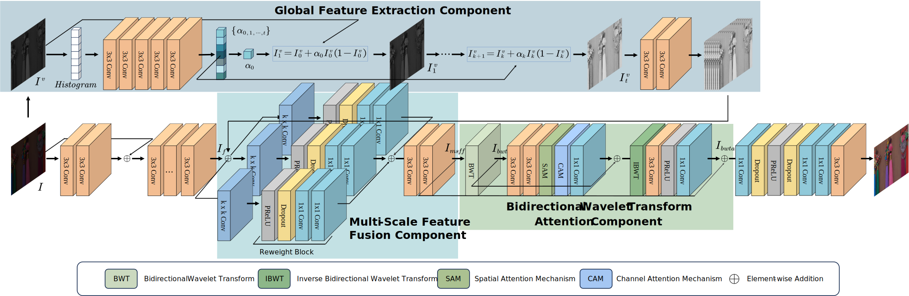
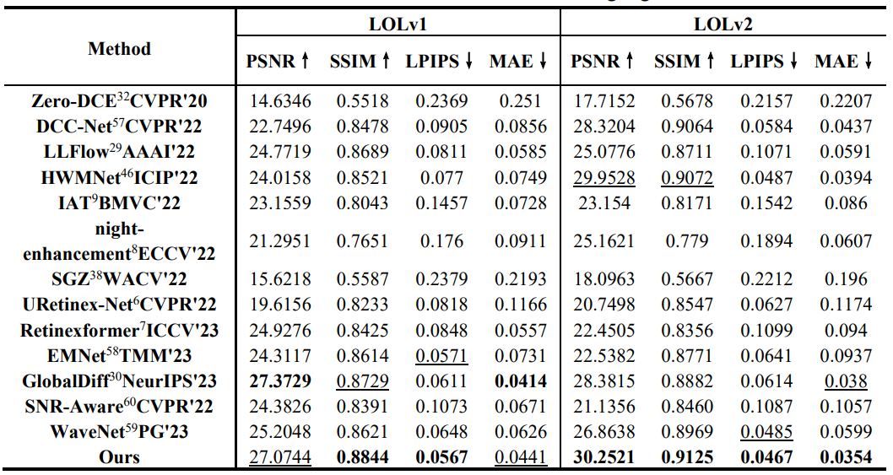

# **From Shadows to Details: Leveraging Multi-Scale Wavelet Features for Low-Light Image Enhancement**

xxx, xxx, xxx (names of paper)

xx xx

## Introduction

This repository is the **official implementation** of the paper, "From Shadows to Details: Leveraging Multi-Scale Wavelet Features for Low-Light Image Enhancement", where more implementation details are presented.

## Overall



## Dataset

You can refer to the following links to download the datasets:

LOL: Chen Wei, Wenjing Wang, Wenhan Yang, and Jiaying Liu. "Deep Retinex Decomposition for Low-Light Enhancement", BMVC, 2018. [[Baiduyun (extracted code: wedn)](https://pan.baidu.com/s/1whZBAKc1NVODqZ2bSEyYXA)] [[Google Drive]](https://drive.google.com/file/d/1gh7-7nPonG7f4bBWLkPNAHTQHNV-HNZ4/view?usp=sharing) <br>
LOL-v2 (the extension work): Wenhan Yang, Haofeng Huang, Wenjing Wang, Shiqi Wang, and Jiaying Liu. "Sparse Gradient Regularized Deep Retinex Network for Robust Low-Light Image Enhancement", TIP, 2021. [[Baiduyun (extracted code: wedn)](https://pan.baidu.com/s/1pn3UffJ_bOlCpNXzehq46g)] [[Google Drive]](https://drive.google.com/file/d/1fu1l6irFcSJ5XrUk-JmECQzBf_k2ScYb/view?usp=sharing) <br>

DICM、LIME、MEF、NPE、CityScape、BDD：[[Baiduyun (extracted code: wedn)](https://pan.baidu.com/s/14QO4jmsAKoEPPGiztuK0OQ)] [[Google Drive](https://drive.google.com/file/d/1P9JJaAsKp61zkcs7vE7iMCTK4J9KIQle/view?usp=sharing)]

 <br>

## Results

The evauluation results on LOL are as follows:



## Get Started

### Requirements

1. Python 3.8
2. Pytorch 2.0.0
3. torchvision 0.17.0
4. cuda 12.1

WEDNet does not need special configurations. Just basic environment.

### Folder structure

```
├── .idea # Project configuration information
├── images # Images for README.md display
│   ├── lol_result.png
│   └── network1.svg
├── pytorch_ssim # Used to calculate SSIM
│   └── __init__.py
├── result # Used to save test results. 
├── snapshots 
│   └── best_epoch.pth # A pre-trained snapshot
├── MyModel.py # WEDNet network
├── Myloss.py # Loss codes
├── README.md
├── WaveletBlock.py # BWTA component code
├── dataloader.py
├── evaluate.py # evaluating code
├── test.py # testing code
├── train.py # training code
├── utils.py
```

### Test:

To test the model with data, You need to specify the data path `filePath` and `filePath_high` in the `test.py` file. Then run

```
python test.py
```

To obtain the evaluation results, e.g., PSNR, SSIM, LPIPS, and MAE. You need to specify the data path `enhance_path` and `highRef_path` in the `evaluate.py` file. Then run

```
python evaluate.py
```

### Train:

You need to specify the data path `lowlight_images_path`,`highlight_images_path`,`val_lowlight_images_path` and `val_highlight_images_path` in the `train.py` file. Then run

```
python train.py
```

## Citation

If you find our work useful for your research, please cite our paper

```
xxxxxx
```

## Contact

If you have any question, please feel free to contact us via chenglfei392@gmail.com.

